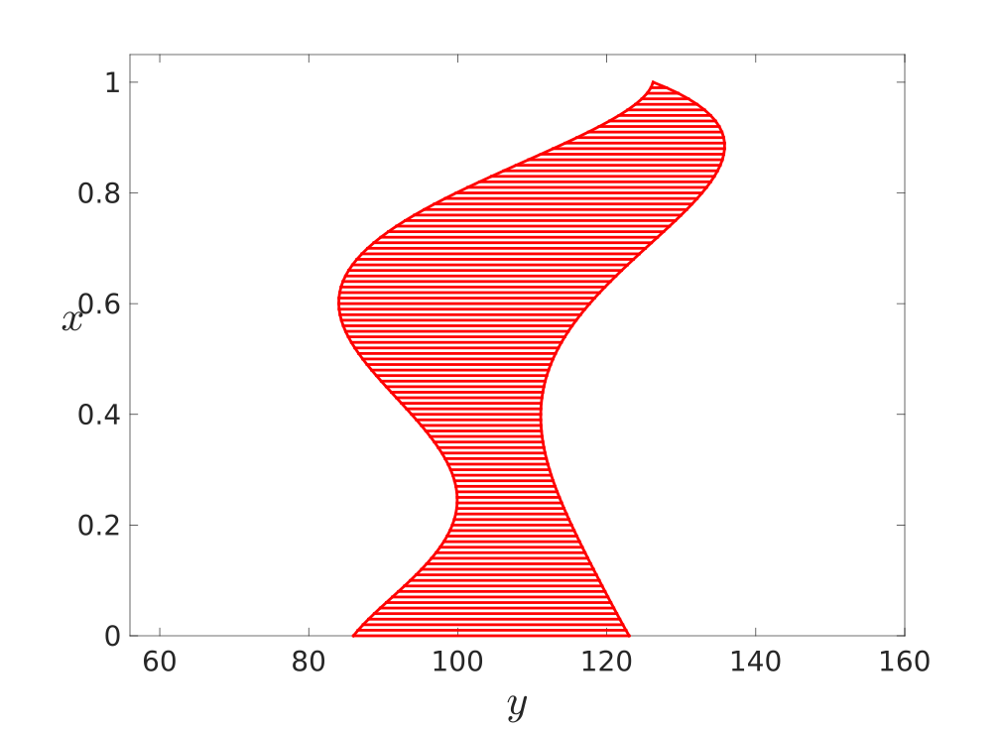
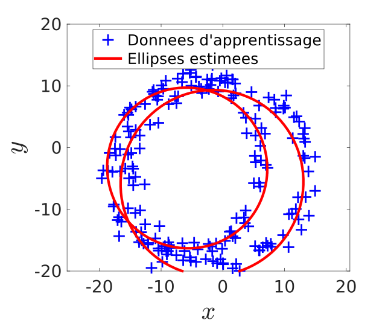

- [Estimation de paramètres](#estimation-de-paramètres)
  - [Introduction](#introduction)
  - [Structure du code](#structure-du-code)
  - [Méthodes impémentées](#méthodes-impémentées)
    - [Implémentation de `moindres_carres`](#implémentation-de-moindres_carres)
    - [Implémentation de `erreur_apprentissage`](#implémentation-de-erreur_apprentissage)
    - [Implémentations de `erreur_generalisation` et `estimation_d_sigma`](#implémentations-de-erreur_generalisation-et-estimation_d_sigma)
    - [Implémentations de `calcul_VC` et `estimation_d_sigma_bis`](#implémentations-de-calcul_vc-et-estimation_d_sigma_bis)
- [Contrôle de la complexité par régularisation](#contrôle-de-la-complexité-par-régularisation)
  - [Introduction](#introduction-1)
  - [Structure du code](#structure-du-code-1)
  - [Méthodes implémentées](#méthodes-implémentées)
    - [Implémentation de `moindes_carres_ecretes`](#implémentation-de-moindes_carres_ecretes)
    - [Implémentation de `calcul_VC_bis` et `estimation_lambda_sigma`](#implémentation-de-calcul_vc_bis-et-estimation_lambda_sigma)
    - [Implémentation de `moindres_carres_bis` et simulation de la silhouette d'une flamme de bougie](#implémentation-de-moindres_carres_bis-et-simulation-de-la-silhouette-dune-flamme-de-bougie)
    - [Implémentation de `estimation_lois_n` et `simulation`](#implémentation-de-estimation_lois_n-et-simulation)
- [Estimation par l'algorithme EM](#estimation-par-lalgorithme-em)
  - [Introduction](#introduction-2)
    - [Estimation par le maximum de vraisemblance](#estimation-par-le-maximum-de-vraisemblance)
    - [Estimation par résolution d'un système linéaire](#estimation-par-résolution-dun-système-linéaire)
    - [Estimation de paramètres d'une paire d'ellipses](#estimation-de-paramètres-dune-paire-dellipses)
    - [Estimation par l'algorithme EM](#estimation-par-lalgorithme-em-1)


# Estimation de paramètres

## Introduction

Cette première partie se donne pour but d'étudier le processus d'estimation des paramètres d'une courbe de Bézier de degré variable, ainsi que des méthodes permettant le choix de son degré.

## Structure du code

Pour des raisons de clarté du code, des choix d'organisation ont été faits afin d'améliorer la structure du projet. Ainsi, la majorité les fonctions fournies avec les sources ont été rassemblées dans la classe `Lib`.

Voici donc l'API de `Lib` utilisée dans les fonctions détaillées ci-dessous:

```yaml
Sealed class Lib:
  Static methods:
    Lib : bernstein(x, d, i) # Polynome de Bernstein (cf documentation)
    Lib : bezier(beta_0, beta, beta_d, x) # Courbe de Bézier (f dans le sujet)
    Lib : gNoise(input, sigma) # Générateur de bruit gaussien additif
    Lib : mean_square_error(input, output) # Erreur quadratique moyenne
```

Ainsi qu'un exemple d'utilisation :

```matlab
y = Lib.gNoise(Lib.bezier(beta_0, beta, beta_d, x), sigma);
```

## Méthodes impémentées

### Implémentation de `moindres_carres`

Après exécution du script `exercice_1`, on obtient une solution approchée de $\hat{\beta}$ qui produit la courbe de Bézier suivante, de degré $d = 20$ choisi au préalable :


<figcaption align="center">
  <b>Fig. 1 : Courbe de Bézier de degré d = 20</b>
</figcaption>

___

La courbe précédente est très clairement biaisée par un surentrainement. Selon la même logique, pour des valeurs de $d$ faibles, on obtient un modèle sous-entrainé, comme le montre le résultat suivant, obtenu pour $d = 2$ :


<figcaption align="center">
  <b>Fig. 2 : Courbe de Bézier de degré d = 2</b>
</figcaption>

___

On se rend cependant très rapidement compte de la nécessité de choisir une valeur du degré plus adaptée, comme par exemple $d = 8$, dont la courbe associée est visible ci-dessous :


<figcaption align="center">
  <b>Fig. 3 : Courbe de Bézier de degré d = 8</b>
</figcaption>

___

Ce résultat est bien plus satisfaisant, et semble coller bien mieux à la courbe du modèle exact.

### Implémentation de `erreur_apprentissage`

L'exécution du script `exercice_2` permet de visualiser l'évolution de l'erreur quadratique moyenne d'apprentissage en fonction du degré de la courbe de Bézier.


<figcaption align="center">
  <b>Fig. 4 : Erreur quadratique moyenne d'apprentissage en fonction du degré</b>
</figcaption>

___

C'est un résultat cohérent, puisque l'erreur décroit en fonction du degré de la courbe de Bézier. Il est cependant pertinent de noter qu'elle varie considérablement moins à partir de $d = 5$.

### Implémentations de `erreur_generalisation` et `estimation_d_sigma`

Lorsque l'on exécute le script `exercice_3`, faisant appel à `erreur_generalisation` et `estimation_d_sigma`, on s'aperçoit que l'erreur de généralisation, contrairement à l'erreur d'apprentissage, a tendance à croitre à partir d'une certaine valeur de $d$, en l'occurence passé le seuil $d_{max} \approx 8$.


<figcaption align="center">
  <b>Fig. 5 : Erreur de généralisation en fonction du degré</b>
</figcaption>

___

Cette propriété est très avantageuse, puisqu'elle pourait nous permettre d'éviter de surentrainer notre modèle, et ainsi de l'améliorer.

### Implémentations de `calcul_VC` et `estimation_d_sigma_bis`

Le script `exercice_4` met en évidence l'utilité de la *cross validation approach* (approche par validation croisée) *leave-one-out* pour l'estimation des paramètres d'une courbe de Bézier. En effet, elle permet de clairement distinguer les valeurs de $d$ pour lesquelles on peut parler de sur-apprentissage et celle pour lesquelles il s'agit d'une sur-généralisation.


<figcaption align="center">
  <b>Fig. 6 : Validation croisée en fonction du degré</b>
</figcaption>

___

# Contrôle de la complexité par régularisation

## Introduction

Dans la partie précédente, on avait exploré deux méthodes d'estimation du degré d'une courbe de Bézier, par minimisation de l'erreur de généralisation ou de la validation croisée. On se donne maintenant pour but d'étudier une approche différente, celle de régularisation.

## Structure du code

Dans cette partie, ainsi que la majorité des suivantes, on a gardé la structure d'origine, très monolithique et simple, majoritairement par manque de temps.
C'est d'ailleurs pour la même raison que les tâches facultatives n'ont pas été abordées.
## Méthodes implémentées

### Implémentation de `moindes_carres_ecretes`

Ici, on a fait le choix de ne plus travailler avec $\beta$ mais avec $\delta$, tq
$$
\left\{
  \begin{array}{ll}
    \hat{\beta} = \argmin_{\beta = \beta_1 ... \beta_{d-1}} \|A\beta^\top - C\|^2\\
    \hat{\delta} = \argmin_{\delta = \delta_1 ... \delta_{d-1}} \|A\delta^\top - C\|^2
  \end{array}
\right.
\newline
\text{avec } C = B - A\overline{\beta}^\top
$$

La fonction `moindres_carres_ecretes` détermine la valeur de $\hat{\beta}$ en appliquand le principe de la *ridge regression* (regression regression). Un hyperparamètre $\lambda$ est ajouté afin de pénaliser les écarts $\delta_i$ les plus importants.

L'exécution suivante du script `exercice_1`, mettant en oeuvre cette méthode, affiche des résultats bien plus satisfaisant que les précédents pour une valeur de lambda faible (0.05).


<figcaption align="center">
  <b>Fig. 7 : Résultats de la méthode moindres_carres_ecretes</b>
</figcaption>

___

En faisant varier lambda dans l'intervalle $[0, 100]$, on constate que plus le lambda est grand, plus la courbe obtenue se rapproche d'une droite reliant les points $P_0$ et $P_d$, comme le montre l'image ci-dessous, prise pour un lambda de $100$.


<figcaption align="center">
  <b>Fig. 8 : Résultats de la méthode moindres_carres_ecretes pour un lambda très élevé</b>
</figcaption>

___

### Implémentation de `calcul_VC_bis` et `estimation_lambda_sigma`

On s'intéresse maintenant au calcul de la validation croisée définie, rappelons-le, par l'expression suivante :
$$
VC = \frac{1}{n_{app}} \sum_{i=1}^{n_{app}} \bigg[y_j - f(\beta_0^*, \hat{\beta}_j, \beta_d^*, x_j)\bigg]^2
$$
que nous appliquons dans la fonction `calcul_VC_bis`. Quant à `estimation_lambda_sigma`, elle ne fait que récupérer l'indice et la valeur du minimum de la liste et les renvoyer casiment tel quel :
```matlab
[m, ind] = min(liste_VC);
lambda_optimal = liste_lambda(ind);
sigma_estime = sqrt(m);
```


<figcaption align="center">
  <b>Fig. 9 : Résultats obtenus après estimation de lambda et de sigma d'après les valeurs de VC</b>
</figcaption>

___


<figcaption align="center">
  <b>Fig. 10 : Valeurs de VC obtenues en fonction de lambda</b>
</figcaption>

___


### Implémentation de `moindres_carres_bis` et simulation de la silhouette d'une flamme de bougie

Pour modéliser l'évolution de la flamme de bougie, on utilise la reformulation du problème proposée par le sujet.
$$
  E^q X^q = F^q
$$
où $X^q$ contient les vecteurs de paramètres $\beta^q$ et $\gamma^q$ concaténés, soit $X^q = [\beta_1^q,...,\beta_{d-1}^q, \gamma_1^q, ..., \gamma_d^q]^\top$ (on a retiré le $\beta_d^q$ par soucis d'optimisation, puisqu'il est égal à $\gamma_d^q$).

Notre implémentation nous permet ainsi d'obtenir une animation en exécutant le script `exercice_2`, dont quelques images sont affichées ci-dessous.

|                          |                          |
| :----------------------: | :----------------------: |
|  |  |
|  |  |
### Implémentation de `estimation_lois_n` et `simulation`

Le corps de la fonction `estimation_lois_n` est assez concis, puisque le calcul des moyennes et des écart types peut se faire à l'aide de fonctions déjà implémentées dans matlab, en l'occurrence, `mean` et `std` (standard deviation) :
```matlab
ecarts_types = std(X);
moyennes = mean(X);
```

La fonction simulation associe aux vecteurs de paramètres $\beta^q$ et $\gamma^q$ deux vecteurs de positions des points de la flamme de bougie, côté gauche et côté droit. Le résultat obtenu est, encore une fois, affiché ci-dessous :


<figcaption align="center">
  <b>Fig. 11 : Capture d'écran de l'animation obtenue (script exercice_4)</b>
</figcaption>

___

Le script `sequence_flammes` ajoute de la couleur à l'animation précédente, nous montrant l'intérêt de cette étude, ainsi que les nombreuses applications qu'elle pourrait avoir, dans le monde des jeux video par exemple. Ci-dessous, on peut voir une capture d'écran de l'animation finale :


<figcaption align="center">
  <b>Fig. 12 : Capture d'écran de l'animation obtenue (script sequence_flammes) avec couleur</b>
</figcaption>

___

# Estimation par l'algorithme EM

## Introduction

Cette nouvelle partie se donne pour but **d'estimer les paramètres d'une ellipse** approximant au mieux un ensemble de points. Les ellipses utilisées ici pour la génération du nuage de point (script `donnees`) sont définies par les cinq paramètres suivants : $a$ demi longueur du grand axe, $e$ excentricité, $x$ abscisse du centre, $y$ ordonnée du centre et $\theta$ angle polaire du grand axe.

### Estimation par le maximum de vraisemblance

Dans un premier temps, on se concentre sur l'implémentation plutôt rudimentaire de la **méthode d'estimation par le maximum de vraisemblance**. On tire des ellipses au hasard et on calcule leur vraisemblance. On choisit alors l'ellipse qui la maximise. Pour rappel, le vraisemblance est obtenue à l'aide de la formule suivante :
$$
  L_p(D_{app}) = \prod_{i=1}^{n_{app}} f_p(P_i)
$$
avec $f_p$ la densité de probabilité des points $P_i \in D_{app}$

Notre implémentation de `max_vraisemblance` nous donne ainsi le résultat suivant :

|  |  |
| :------------------------------------------: | :----------------------------------: |
|              Fig. 13 : Données               |     Fig. 14 : Estimation obtenue     |

C'est une approche satisfaisante, puisque **le score retourné est de 0.95 environ**, mais elle reste néanmoins assez peu flexible, car moins fiable pour des nuages de points plus dispersés.

### Estimation par résolution d'un système linéaire

On s'intéresse maintenant à une approche mettant en oeuvre une résolution en moindres carrés du système linéaire homogène :
$$
  AX = O_{n_{app}}
$$
tel que 
$$
  X = [\alpha, \beta, \gamma, \delta, \epsilon, \phi]^\top\newline A\in \mathcal{M}_{n_{app} \times 6}(\mathbb{R})\newline O\in \mathbb{R}^{n_{app}} \text{ est le vecteur nul.} 
$$
et ce sextuplet de coefficients vérifie l'équation cartésienne de l'ellipse recherchée :
$$
  \alpha x^2 + \beta xy + \gamma y^2 + \delta x + \epsilon y + \phi = 0
$$

Il est important de noter que, pour un écart-type $\sigma$ nul, le **score de l'estimation par résolution du système linéaire est de 1**, ce qui est logique puisque les points ne sont pas dispersés et qu'aucun bruit n'est introduit. Ce n'est néanmoins pas le cas de la méthode précédente (maximum de vraisemblance), qui affiche un **score de 0.91**, ce qui démontre encore une fois son manque de fiabilité.

Pour $\sigma = 1$, voici le résultat obtenu :

|  |  |
| :------------------------------------------: | :----------------------------------: |
|              Fig. 15 : Données               |     Fig. 16 : Estimation obtenue     |

Avec les scores suivants :
```console
Score de l'estimation par MV (Maximum de vraisemblance) : 0.948
Score de l'estimation par MC (Moindres carrés): 0.931
```
Il est assez difficile de se prononcer sur l'efficacité de cette méthode vis-à-vis de la précédente simplement à partir de ces images, mais statistiquement, et surtout après de nombreux tests, la méthode MC semble l'emporter en termes de précision.

### Estimation de paramètres d'une paire d'ellipses

Le problème se complexifie ici nettement, avec l'introduction d'une nouvelle ellipse dans le dataset, grâce au script `donnees_2`, une nouvelle difficulté que la fonction `max_vraisemblance_2` aborde en maximisant la log-vraisemblance $\ln(L_{P_1, P_2}(D_{app}))$ :
$$
  \max_{P_1, P_2} \bigg\{\ln\prod_{i=1}^{n_{app}} f_{P_1, P_2} (P_i) \bigg\}
$$

La fonction `probabilites`, elle, permet d'associer les points à l'ellipse la plus proche, et partitionne ainsi les points en deux classes $k = 1$ et $k = 2$.

Les résultats obtenus sont les suivants :


___
<figcaption align="center">
  <b>Fig. 17 : Données d'origine</b>
</figcaption>


|  |  |
| :-------------------------------------------: | :--------------------------------------------: |
|      Fig. 18 : Maximum de vraisemblance       |           Fig. 19 : Moindres carrés            |

Par la suite, on se propose d'améliorer grandement les performances de cet algorithme grace à l'espérance-minisation.

### Estimation par l'algorithme EM

> L’algorithme EM (Espérance-Maximisation) est un algorithme très général. Il s’inspire de cette
idée, à ceci près qu’il n’effectue pas une partition stricte des données.

On a ainsi créé les fonctions `probabilites_EM` et `moindres_carres_ponderes` qui permettent d'appliquer cette méthode (cf. sujet pour détails concernant les calculs réalisés).

A terme, on obtient des scores plutôt impressionnants :
```console
Score de l'estimation par MV : 0.785
Score de l'estimation par MC : 0.914
Score de l'estimation par EM : 0.977
```
avec l'algorithme EM loin en tête en termes de précision.
Le script `exercice_4` ne parvient néanmoins pas toujours à trouver la bonne paire d'ellipses dans les situations où le résultat de l'estimation par MC, que l'on utilise comme point de départ, est trop éloigné de la réalité, et où les ellipses sont trop proches.

