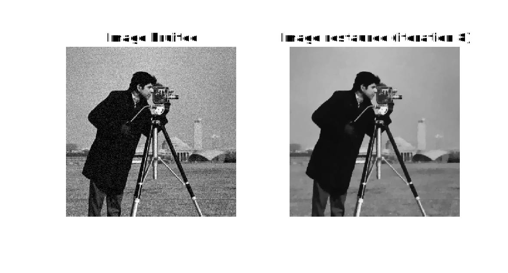
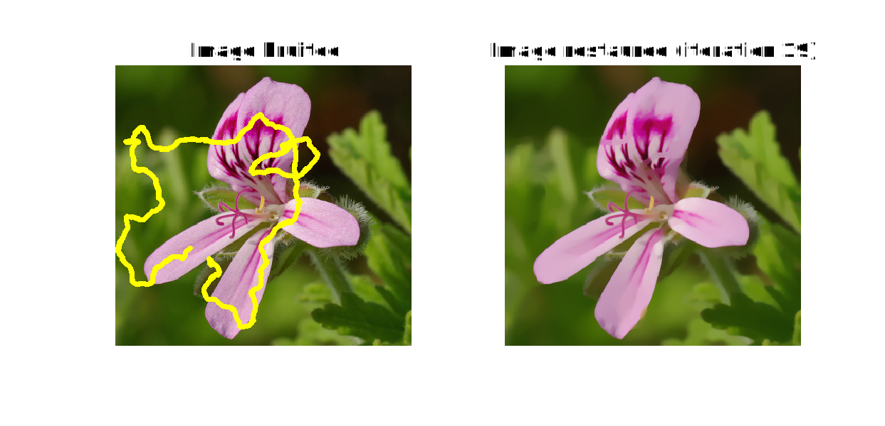
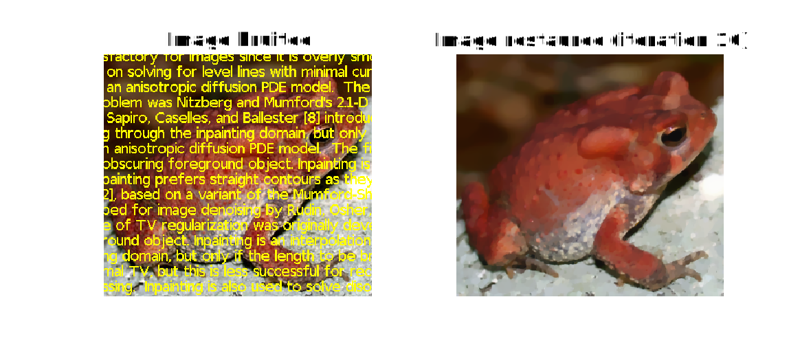
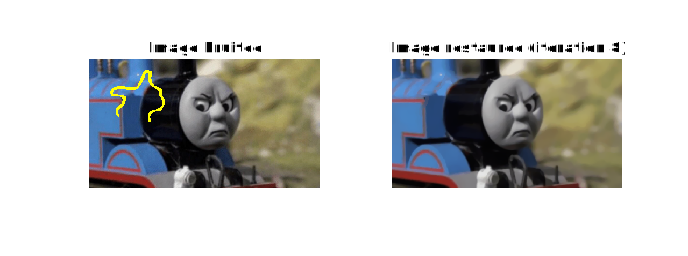
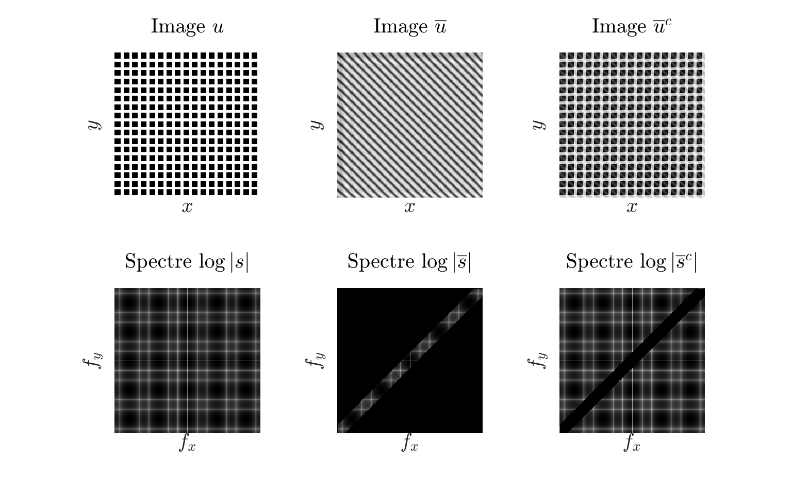
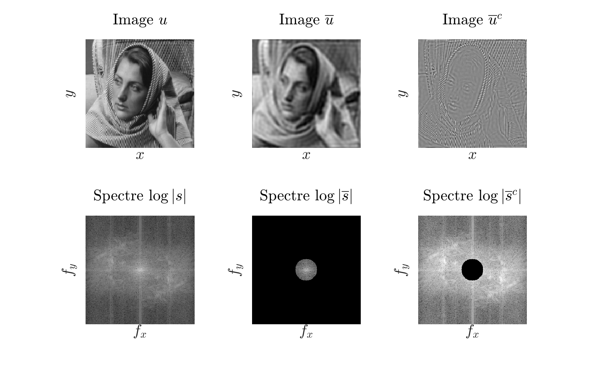
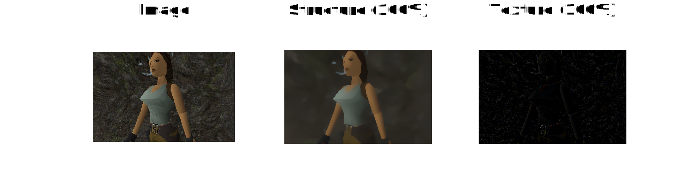
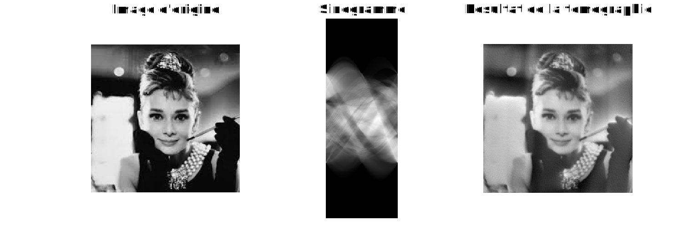
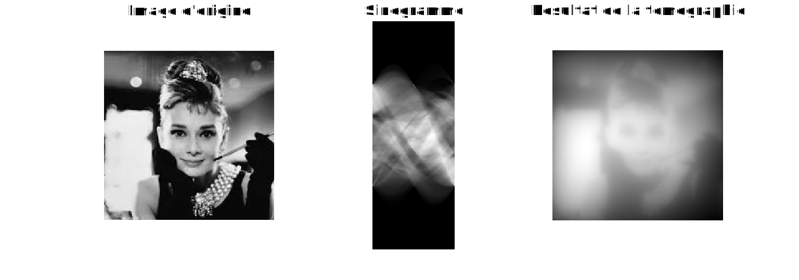

- [Abstract](#abstract)
- [Restauration d'images](#restauration-dimages)
  - [Débruitage par variation totale](#débruitage-par-variation-totale)
  - [Inpainting par variation totale](#inpainting-par-variation-totale)
- [Techniques de photomontage](#techniques-de-photomontage)
  - [Photomontage par collage](#photomontage-par-collage)
  - [Décoloration partielle d'une image](#décoloration-partielle-dune-image)
- [Décomposition d'une image](#décomposition-dune-image)
  - [Décomposition par modification de spectre](#décomposition-par-modification-de-spectre)
  - [Décomposition par modèle ROF](#décomposition-par-modèle-rof)
- [Tomographie](#tomographie)
  - [Résolution algébrique](#résolution-algébrique)
  - [Résolution par rétroprojection](#résolution-par-rétroprojection)
- [Conclusion](#conclusion)

# Abstract
Ce rapport présente l'intégralité du travail réalisé dans le cadre des TP 6 à 12 de traitement de données audio-visuelles. Les images et extraits de code utilisés ici sont fournis uniquement à titre d'illustration de mes propos, et ne constituent en aucun cas une solution idéale aux questions posées. Toute utilisation de ces résultats devra donc se faire avec prudence.

# Restauration d'images

## Débruitage par variation totale
La fonction `debruitage` que nous nous sommes dans un premier temps donné pour but d'implémenter minimise la variation totale de l'image, approximation de la régularisation quadratique du modèle "Tikhonov", dont l'expression est la suivante:
$$
\begin{equation}
E_{TV}(u) = \int\int_{\Omega} \bigg\{ \frac{(u(x, y) - u_0(x, y))^2}{2} + \lambda\sqrt{|\nabla u(x, y)|^2 + \epsilon} \bigg\} dx \space dy
\end{equation}
$$

Les résultats obtenus pour une image en noir et blanc (1 unique canal) sont satisfaisants, mais semblent plus fidèles pour un lambda proche de 10 (perte de détail moindre).

<figcaption align="center">
  <b>Fig. 1 : Débruitage monocanal pour lambda = 15</b>
</figcaption>

<figcaption align="center">
  <b>Fig. 2 : Débruitage monocanal pour lambda = 10</b>
</figcaption>

On peut par la suite appliquer cette méthode à une image en couleur (3 canaux), selon le même principe:

<figcaption align="center">
  <b>Fig. 3 : Débruitage 3 canaux pour lambda = 15</b>
</figcaption>

## Inpainting par variation totale

On s'intéresse maintenant à une autre application du modèle utilisé précédemment : l'inpainting. Le but est de réparer une image qui a été détériorée par l'ajout d'un defaut. Dans un premier temps, on utilisera une carte qui permet de localiser ce defaut:

<figcaption align="center">
  <b>Fig. 4 : Inpainting - suppression de defaut - pour lambda = 15</b>
</figcaption>

Dans un second temps, on n'utilise plus de carte, mais un critère de couleur qui permet de localiser le defaut. En l'occurence, on utilise ici la couleur jaune **rgb(255, 255, 0)**:

<figcaption align="center">
  <b>Fig. 5 : Inpainting - suppression de texte - pour lambda = 15</b>
</figcaption>

<figcaption align="center">
  <b>Fig. 6 : Inpainting - suppression de defaut - pour lambda = 15</b>
</figcaption>

Cette méthode est très efficace, comme en témoignent les résultats obtenus, cependant elle ne fonctionne que pour des défauts de faible largeur (traits ou texte).

# Techniques de photomontage

## Photomontage par collage

L'approche la plus naïve "colle" une image détourée par à l'aide d'un masque sur une autre image. Un exemple ci-dessous:

<figcaption align="center">
  <b>Fig. 7 : Photomontage par collage naïf</b>
</figcaption>

Une version plus évoluée de cet algorithme fait appel aux techniques d'inpainting utilisées précédemment, adaptées de façon à adapter les couleurs de l'image détourée à celle de l'image de base.

<figcaption align="center">
  <b>Fig. 8 : Photomontages par collage intelligent</b>
</figcaption>

## Décoloration partielle d'une image

La même fonction collage peut être utilisée pour décolorer une image: On utilise une source et une cible identiques, mais on convertit au préalable l'image cible en niveaux de gris avant de coller. On obtient alors les résultats suivants:

<figcaption align="center">
  <b>Fig. 9 : Photomontages par décoloration partielle</b>
</figcaption>

# Décomposition d'une image

Dans cette partie, on se propose d'étudier la décomposition d'une image d'entrée $u$ en deux autres images $\overline{u}$ et $\overline{u}^c$ de tailles identiques à $u$, et telles que leur somme est égale à $u$. Ce sujet est assez large, c'est pourquoi nous nous limiterons ici aux décompositions structure-texture.

## Décomposition par modification de spectre

<figcaption align="center">
  <b>Fig. 10 : Exemple de modification de spectre d'une grille</b>
</figcaption>

<figcaption align="center">
  <b>Fig. 11 : Décomposition structure-texture par modification de spectre</b>
</figcaption>

## Décomposition par modèle ROF

Il est toutefois tout à fait possible de séparer structure et texture sans passer par la transformée de Fourier. On peut utiliser une approche variationnelle, en l'occurence le modèle ROF défini comme suit:

$$
\begin{equation}
E_{ROF}(\overline{u}) = \int \int_{\omega} \bigg\{\frac{1}{2} [\overline{u}(x, y) - u(x, y)]^2 + \lambda |\nabla \overline{u}(x, y)|_{\epsilon} \bigg\} \space dx \space dy
\end{equation}
$$

<figcaption align="center">
  <b>Fig. 13 : Décompositions structure-texture par modèle ROF</b>
</figcaption>

On remarque un très clair lissage de l'image de structure (au milieu), ce qui est cohérent puisque la texture a été retirée. L'image de texture semble récupérer toutes les imperfections de l'image d'origine, un résultat qui correspond encore une fois à nos attentes.

# Tomographie

La tomographie est une technique d'imagerie par sections non destructive, permettant de reconstruire le volume d'un objet à partir de multiple mesures effectuées depuis l'extérieur de celui-ci. Elle fait appel à une transformation, dite "de Radon", qui pour une de ces mesures (en l'occurence, une section) donne sa projection orthogonale 
sur une droite $D$ d'angle polaire $\theta$, moyennant une abscisse $t$.

## Résolution algébrique

Après lancement du script de calcul du sinogramme, et résolution à l'aide de l'algorithme de Kaczmarz, on obtient le résultat suivants:

<figcaption align="center">
  <b>Fig. 14 : Tomographie - résolution algébrique</b>
</figcaption>

## Résolution par rétroprojection

# Conclusion

Cette étude a été très intéressante, et m'a permis d'aborder une multitude de problématiques du traitement d'image aussi passionnantes que variées. J'aurais aimé pouvoir y consacrer plus de temps, et faire notamment les parties facultatives des TP, mais le travail requis dans les autres matières ne m'a pas permis de le faire.
