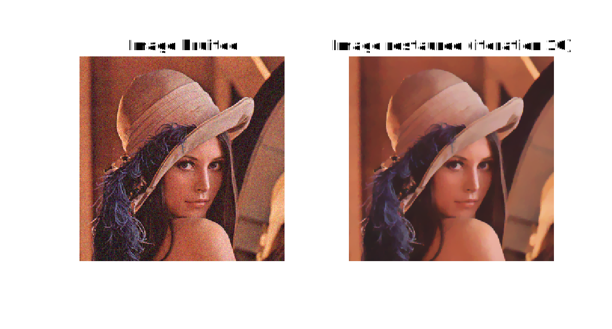

- [Abstract](#abstract)
- [Restauration d'images](#restauration-dimages)
  - [Débruitage par variation totale](#débruitage-par-variation-totale)
  - [Inpainting par variation totale](#inpainting-par-variation-totale)
- [Techniques de photomontage](#techniques-de-photomontage)
- [Décomposition d'une image](#décomposition-dune-image)
- [Conclusion](#conclusion)

# Abstract
Ce rapport présente l'intégralité du travail réalisé dans le cadre des TP 6 à 12 de traitement de données audio-visuelles. Les images et extraits de code utilisés ici sont fournis uniquement à titre d'illustration de mes propos, et ne constituent en aucun cas une solution idéale aux questions posées. Toute utilisation de ces résultats devra donc se faire avec prudence.

# Restauration d'images

## Débruitage par variation totale
La fonction `debruitage` que nous nous sommes dans un premier temps donné pour but d'implémenter minimise la variation totale de l'image, approximation de la régularisation quadratique du modèle "Tikhonov", dont l'expression est la suivante:
$$
\begin{equation}
E_{TV}(u) = \int\int_{\Omega} \bigg\{ \frac{(u(x, y) - u_0(x, y))^2}{2} + \lambda\sqrt{|\nabla u(x, y)|^2 + \epsilon} \bigg\} dx \space dy
\end{equation}
$$

Les résultats obtenus pour une image en noir et blanc (1 unique canal) sont satisfaisants, mais semblent plus fidèles pour un lambda proche de 10 (perte de détail moindre).

<figcaption align="center">
  <b>Fig. 1 : Débruitage monocanal pour lambda = 15</b>
</figcaption>

<figcaption align="center">
  <b>Fig. 2 : Débruitage monocanal pour lambda = 10</b>
</figcaption>

On peut par la suite appliquer cette méthode à une image en couleur (3 canaux), selon le même principe:

<figcaption align="center">
  <b>Fig. 3 : Débruitage 3 canaux pour lambda = 15</b>
</figcaption>

## Inpainting par variation totale

On s'intéresse maintenant à une autre application du modèle utilisé précédemment : l'inpainting. Le but est de réparer une image qui a été détériorée par l'ajout d'un defaut. Dans un premier temps, on utilisera une carte qui permet de localiser ce defaut:

<figcaption align="center">
  <b>Fig. 4 : Inpainting pour lambda = 15</b>
</figcaption>

Dans un second temps, on n'utilise plus de carte, mais un critère de couleur qui permet de localiser le defaut:

<figcaption align="center">
  <b>Fig. 5 : Inpainting pour lambda = 15</b>
</figcaption>

# Techniques de photomontage

# Décomposition d'une image

# Conclusion

Cette étude a été très intéressante, et m'a permis d'aborder une multitude de problématiques du traitement d'image aussi passionnantes que variées. J'aurais aimé pouvoir y consacrer plus de temps, et faire notamment les parties facultatives des TP, mais le travail requis dans les autres matières ne m'a pas permis de le faire.
